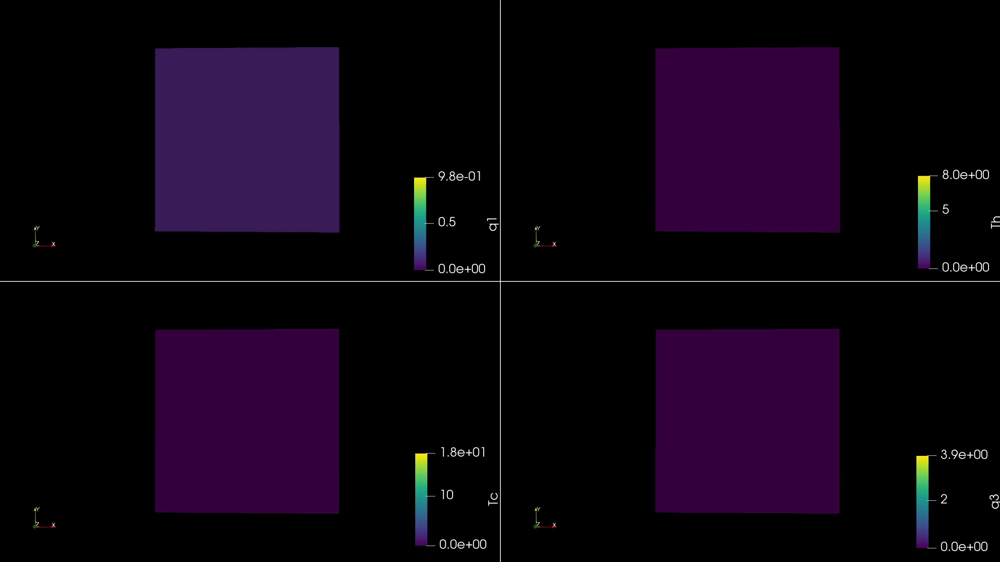
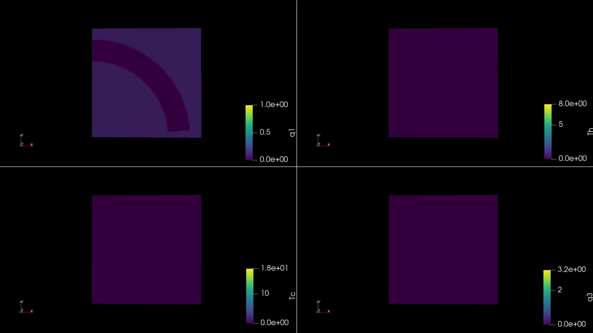
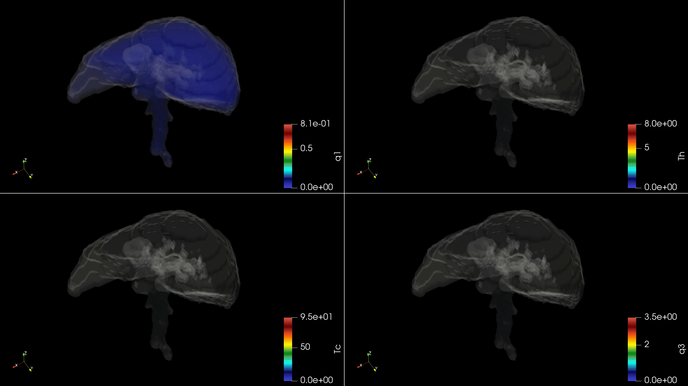

# HepGPU Results

Simulation results and visualizations generated with **HepGPU** for the numerical modeling of hepatitis B virus (HBV) infection and immune response in the liver.

### 1D simulations

The one-dimensional model provides a simplified representation of the spatial evolution of the infection and immune response.

#### Infection dynamics

### 2D simulations

Two-dimensional simulations are used to investigate the influence of spatial heterogeneity and transport restrictions on infection dynamics.

#### Maze simulation

Simulation including internal barriers that restrict transport and modify the spatial propagation of the different populations.

### 3D simulations

Three-dimensional simulations extend the model to more complex geometries and allow the effect of heterogeneous transport and internal barriers to be investigated.

## HepGPU

The simulations presented in this repository were generated using [**HepGPU**](https://github.com/navasmontilla/HepGPU/tree/main), a Python package developed for the numerical simulation of virus spread and immune response in the liver.

HepGPU source code and installation instructions are available in the main HepGPU repository.
