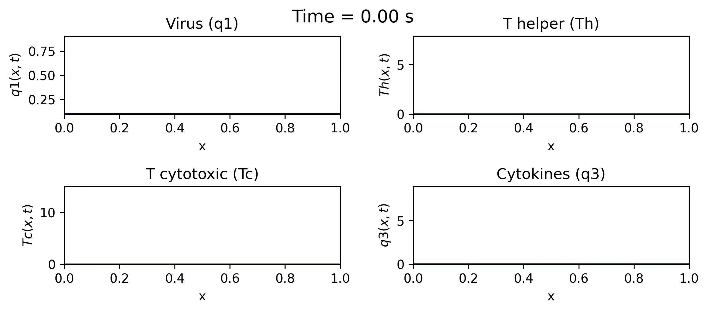
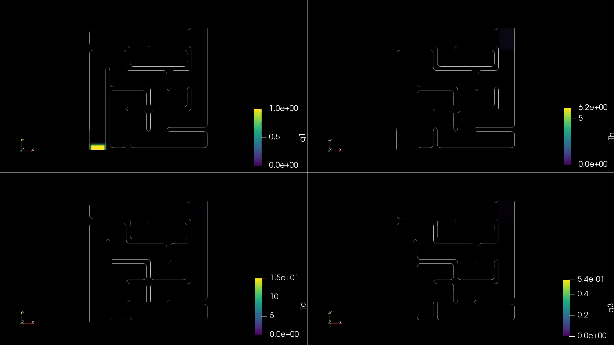

# HepGPU Results

Simulation results and visualizations generated with **HepGPU** for the numerical modeling of hepatitis B virus (HBV) infection and immune response in the liver.

## Overview

This repository contains selected results obtained with HepGPU, including simulations in one-, two-, and three-dimensional domains.

The examples illustrate the spatial and temporal evolution of the viral infection and immune response under different transport conditions and geometrical configurations.

The simulated variables are:

- `q1`: viral concentration
- `Th`: helper T lymphocytes
- `Tc`: cytotoxic T lymphocytes
- `q3`: cytokine concentration

## Results

### 1D simulations

The one-dimensional model provides a simplified representation of the spatial evolution of the infection and immune response.

#### Infection dynamics

### 2D simulations

Two-dimensional simulations are used to investigate the influence of spatial heterogeneity and transport restrictions on infection dynamics.

#### Unobstructed domain

Simulation of the infection and immune response in a domain without internal transport barriers.

#### Maze-like barriers

Simulation including internal barriers that restrict transport and modify the spatial propagation of the different populations.

### 3D simulations

Three-dimensional simulations extend the model to more complex geometries and allow the effect of heterogeneous transport and internal barriers to be investigated.

#### Elimination infection with transport barriers

#### Chronic infection

## HepGPU

The simulations presented in this repository were generated using **HepGPU**, a Python package developed for the numerical simulation of virus spread and immune response in the liver.

HepGPU source code and installation instructions are available in the main HepGPU repository.

## Authors

This repository contains results generated as part of the development and validation of HepGPU.
